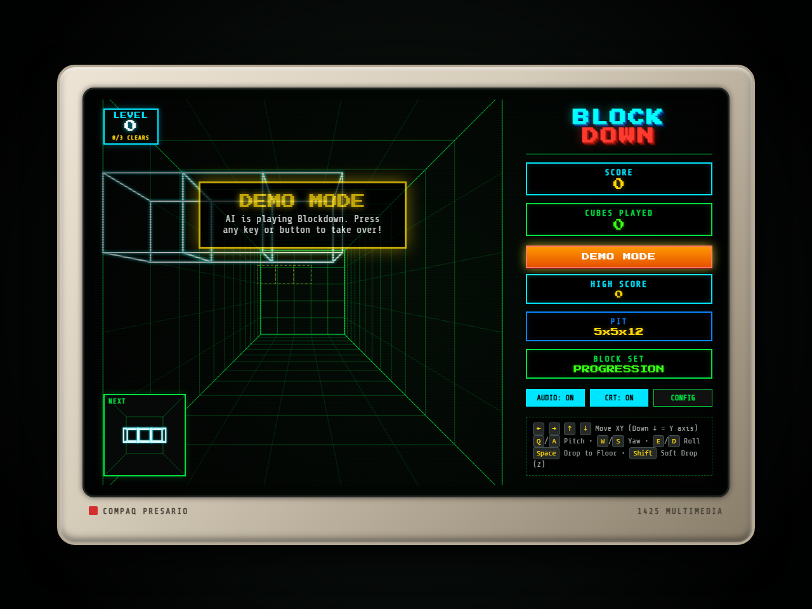

# BLOCKDOWN

> *Like the classic Blockout... but down!*

A faithful web-based clone of California Dreams' legendary 1989 DOS 3D puzzle game **Blockout**, featuring retro 1989 CRT aesthetics, vintage 1-bit PC speaker sound effects, a progressive level unlocking system, and an autonomous AI Demo Mode.



---

## Features

- **Retro 1989 DOS Graphics**:
  - Classic green phosphor wireframe perspective tunnel with depth segments.
  - Placed blocks color-coded by depth layer (classic Royal Blue bottom layer, Cyan, Emerald Green, Yellow, Orange, Red, Magenta).
  - Vintage **Compaq Presario 1425 Multimedia** CRT monitor bezel with scanlines, curvature, and screen glow (toggleable via `CRT: ON/OFF`).
  - 3D shaded isometric **BLOCK DOWN** logo and retro DOS HUD layout.
  - 3D rotating **Next Piece** wireframe preview box.
- **Vintage PC Speaker Sound Effects**:
  - Authentically synthesized 1-bit square-wave pulses via Web Audio API: movement ticks, 3D rotation chirps, solid drop thuds, 8-bit staccato layer clear arpeggios, level-up fanfares, and the full **BLOCK OUT** jackpot clear!
- **Progressive Level System**:
  - Levels advance **strictly when complete horizontal layers (5x5 grids = 25 cubes) are cleared** (default: 3 cleared grids per level).
  - **Level 0 (The Basics)**: Monocube (1), Domino (2), Tromino-I (3), Tromino-L (3).
  - **Level 1 (Flat Tetrominoes)**: Unlocks Square-O (2x2), Straight-I (1x4), Flat-L (4), Flat-T (4).
  - **Level 2 (Skew & Introductory 3D)**: Unlocks Flat-Z snake, 3D Tripod/Corner, and 3D-T.
  - **Level 3 (Soma 3D Chiral Pieces)**: Unlocks full 3D chiral pieces (Screw-Left, Screw-Right, 3D-L).
  - **Level 4+ (Extended Pentacubes)**: Unlocks complex 5-cube shapes.
  - Descent speed gradually accelerates as you advance!
- **Autonomous AI Demo Mode**:
  - Automatically activates on boot just like classic arcade/DOS games!
  - Real-time 3D heuristic AI demonstrates gameplay; touch any key to immediately take over.
- **Full Customization (CONFIG)**:
  - Pit Dimensions: 5x5x12 (Classic), 3x3x10 (Compact), 5x5x10, 7x7x18 (Cavern).
  - Block Sets: Level Progression, Flat Only, Basic (Soma), Extended (All 41 polycubes).
  - Clears to Level Up: 2, 3 (Default), 4, or 5 full grids.

---

## Quick Start

### Windows (Double-Click)
Double-click `run.bat`. It will start the local server and automatically open your default browser to the game.

### Command Line
```bash
# Clone the repository
git clone https://github.com/seanodotcom/blockdown.git
cd blockdown

# Start local server
npm start
```
Then navigate to `http://127.0.0.1:3000` in your web browser.

---

## Controls

Blockdown supports both **Classic DOS** (default) and **WASD Mode** control layouts:

| Action | Classic DOS Scheme (Default) | WASD Mode |
| :--- | :--- | :--- |
| **Move XY (Pit Opening)** | <kbd>&larr;</kbd> <kbd>&rarr;</kbd> <kbd>&uarr;</kbd> <kbd>&darr;</kbd> (<kbd>&darr;</kbd> = Down on Y) | <kbd>W</kbd> <kbd>A</kbd> <kbd>S</kbd> <kbd>D</kbd> or <kbd>Arrows</kbd> (<kbd>S</kbd> / <kbd>&darr;</kbd> = Down on Y) |
| **Pitch (Tilt Up/Down)** | <kbd>Q</kbd> / <kbd>A</kbd> (or NumPad <kbd>7</kbd>/<kbd>4</kbd>) | <kbd>U</kbd> / <kbd>J</kbd> (or NumPad <kbd>7</kbd>/<kbd>4</kbd>) |
| **Yaw (Turn Left/Right)** | <kbd>W</kbd> / <kbd>S</kbd> (or NumPad <kbd>8</kbd>/<kbd>5</kbd>) | <kbd>I</kbd> / <kbd>K</kbd> (or NumPad <kbd>8</kbd>/<kbd>5</kbd>) |
| **Roll (Spin CW/CCW)** | <kbd>E</kbd> / <kbd>D</kbd> (or NumPad <kbd>9</kbd>/<kbd>6</kbd>) | <kbd>O</kbd> / <kbd>L</kbd> (or NumPad <kbd>9</kbd>/<kbd>6</kbd>) |
| **Hard Drop (to Floor)** | <kbd>Space</kbd> | <kbd>Space</kbd> |
| **Soft Drop (1 step in Z)** | <kbd>Shift</kbd> or <kbd>Enter</kbd> | <kbd>Shift</kbd> or <kbd>Enter</kbd> |
| **Pause / Resume** | <kbd>P</kbd> | <kbd>P</kbd> |
| **Restart Game** | <kbd>R</kbd> | <kbd>R</kbd> |
| **Toggle Mute** | <kbd>M</kbd> | <kbd>M</kbd> |

*On-screen touch and mouse buttons are also provided at the bottom of the screen for accessibility and mobile testing.*

---

## Running Tests

Run the engine test suite (verifying 3D rotations, collision, layer clearing, scoring, and AI solver):
```bash
npm test
```

---

## License

MIT License
